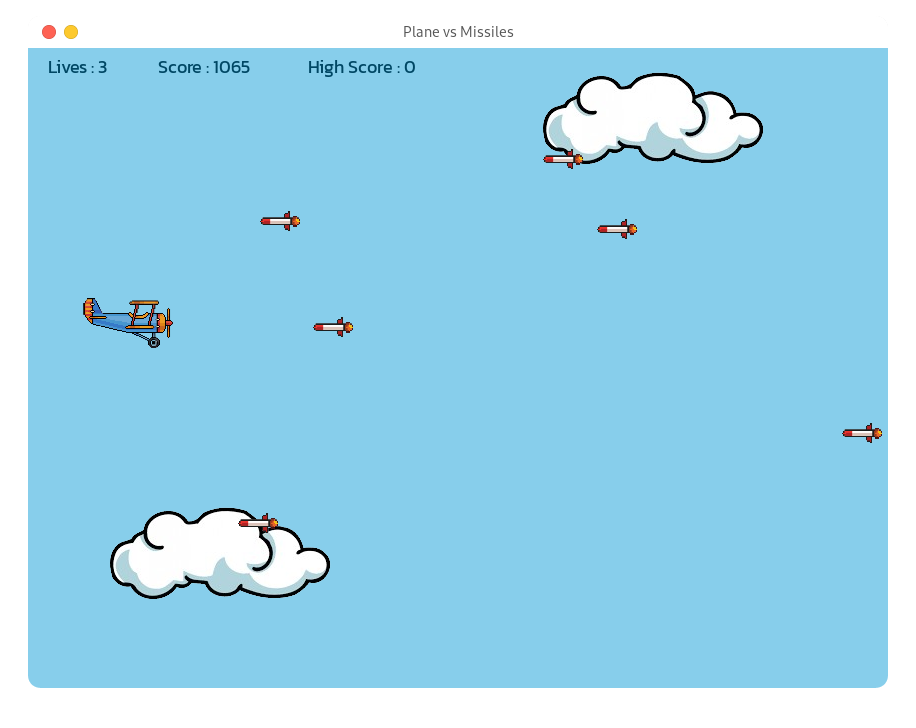

# Plane vs Missiles

<center>
    
</center>

## Play

I could not export it to Windows `.exe` file and Linux executable file, so I'd assume that you already have Python installed.

First, clone the repository :
```sh
git clone https://github.com/luthpai/plane-vs-missiles.git
cd plane-vs-missiles
```

Then, install the required packages : 
```sh
pip install -r requirements.txt
```
And you can play by running the `main.py` file :
```sh
python main.py
```

## License

Apache License 2.0 &copy; Luthfi Afriansyah

## Credits

- Plane image : Freepik
- Missile image : Kindpng
- Cloud image : TopPNG
- Music : Pixabay
- Sound Effects : Mixkit